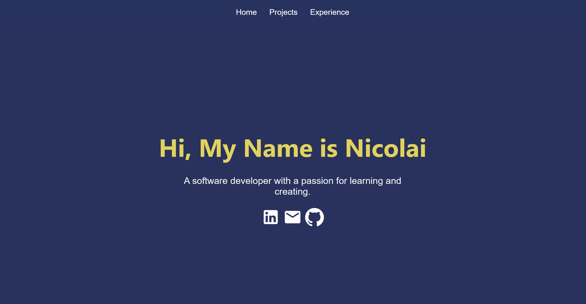
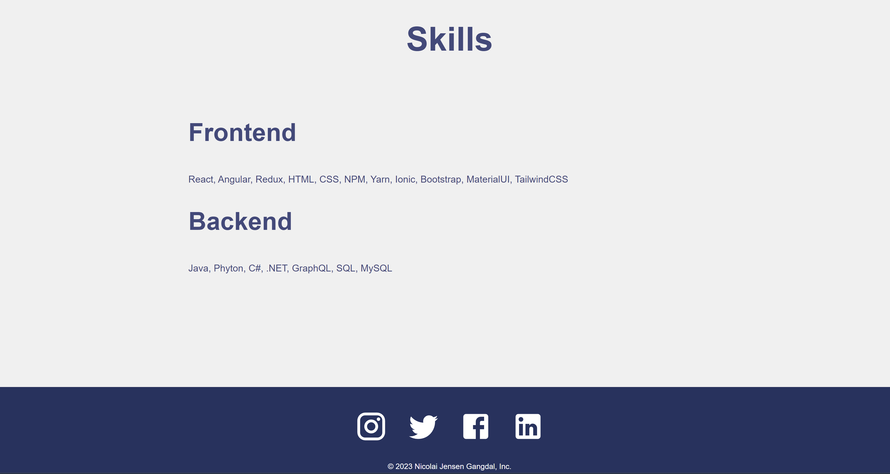
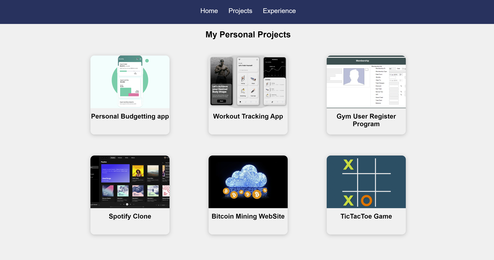
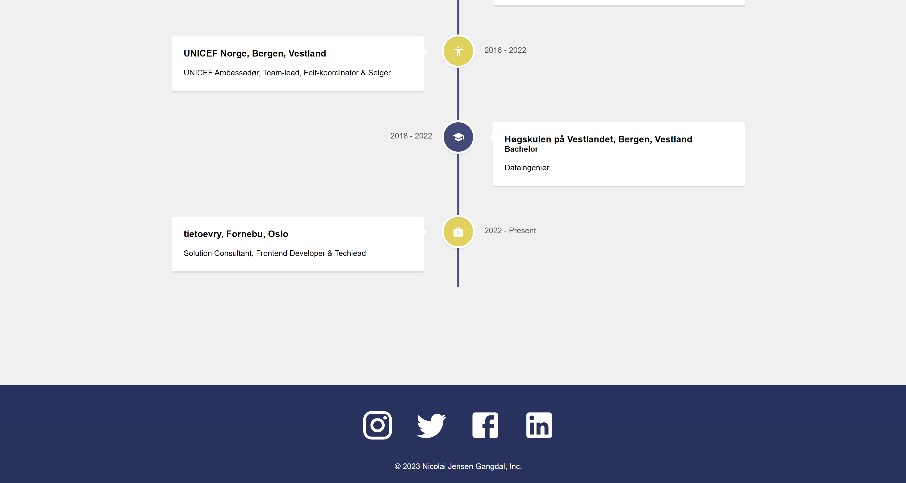

# Welcome To My Portfolio WebPage

Click here to go to WebSite [Open Portfolio](https://nicolaijgangdal.github.io/WebPortfolio).

## About the WebSite

### `Creation of the project`

This project was created in VsCode using:  
`npx create-react-app WebPortfolio`

The WebSites purpose is to practice coding in React, but also creating a platform  
that displays my other projects as well as a little info about myself.

### `Imports used`

The imports i used for this project was:  

**npm install @material-ui/core @material-ui/icons**  
**npm install react-router-dom react-vertical-timeline-component**

##

### `Home`

The Homepage displays a short list of the technoligies i have been working with.  
The whole WebSite features a NavBar that can be seen at the top,  
as well as a interactive footer at the bottom of the page.

The skills featured at the bottom might be outdated, because I'm spending my time 
developing new projects.

##

### `Projects`

The Projects-page features a list of projects i have done, I'm currently working on  
and some example projects to fill the empty space.

All the projects here are clickable and will open a new page showing a preview of the project.  
The preview contains screenshots, information and a clickable GitHub-icon  
that redirects to the corresponding project-repository.

##

### `Experience`

The Experience-page features a timeline showing my work and education experiences.  
It goes back to High-School and all the way to where I'm working today.

